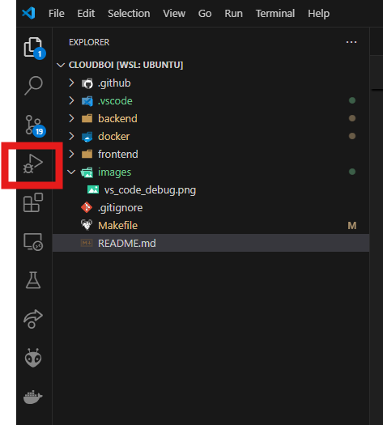
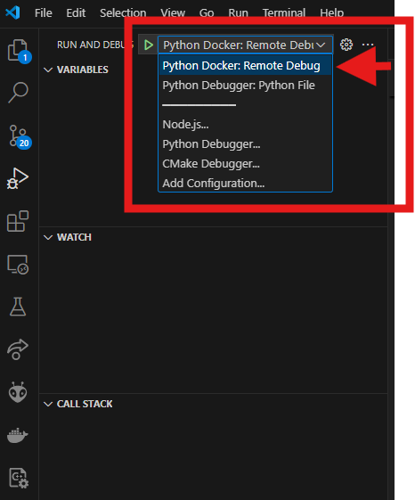

# Cloudboi

monorepo for cloudboi projects

# Prerequisite

for windows, please run everything in WSL

- python>=3.12.0
- nodejs>=22
- pnpm `npm install --global pnpm`
- docker

# For ubuntu wsl instruction

- install git
- Enable WSL Feature in Windows then reboot system
- Install Ubuntu from Microsoft Store, setup password by open Ubuntu

> ## BEFORE CONTINUING -> INSTALL DOCKER DESKTOP

https://www.docker.com/products/docker-desktop/

- clone the project
- open up terminal in `cloudboi` folder
- do `wsl` then do the following command

```sh
sudo groupadd docker
sudo usermod -aG docker $USER
newgrp docker

sudo chown "$USER":"$USER" /home/"$USER"/.docker -R
sudo chmod g+rwx "$HOME/.docker" -R

sudo apt update
sudo add-apt-repository ppa:deadsnakes/ppa
sudo apt install python-is-python3 python3 python3.12-venv python3-pip python3-full git make

curl -o- https://raw.githubusercontent.com/nvm-sh/nvm/v0.40.1/install.sh | bash

nvm install 23
nvm use 23

npm install -g pnpm

make install
```

- then run `make dev` to start the project

# Contribution

please create a branch with feature as name then request a pull request review on that branch

# Running project

- Make sure to initialize the database first before running the project by using:
```sh
make db-up
```
- You can run the whole project on your local machine by using:
```sh
make dev
```
- You can also start the backend in a Docker container by using:
```sh
make backend-up
```

# Debugging

#### Frontend
- TBD

#### Backend
- run the following command(don't forget to open docker desktop first)
    ```sh
    make db-up backend-debug
    ```
- click on debug tab on vs code

- choose `Python Docker: Remote Debug` then click run


# Document for backend

fastapi should auto generate schema at http://localhost:8000/docs

# Generating client for frontend

make sure the project is running and then execute this command in another terminal

```sh
make gen-client
```

or you can manually use pnpm in project folder

```sh
cd frontend
pnpm gen-client
```
